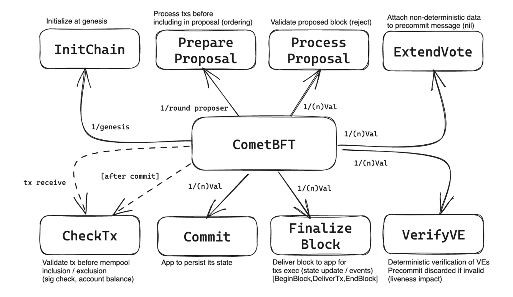

## Abstract

Currently, Heimdall uses a fork of `cosmos-sdk`, which has been modified to support the specific needs of Polygon PoS, and is based on version `v0.37.4`. We propose a refactoring that will upgrade such dependency to target version `v0.50.x`.

## Motivation

The primary motivation for such an upgrade is to remove tech debt currently anchoring Heimdall to an outdated `cosmos-sdk` version released around four years ago. `v0.37.4` is also no longer supported by the team that stewards the Cosmos SDK (EOL version).

## Specification

This proposal integrates ABCI v2.0 (a.k.a. ABCI++) into Heimdall, enhancing the interaction between the consensus layer (CometBFT) and the application layer. ABCI v2.0 introduces a more granular interface that allows the application to interact with the consensus process during block proposal, voting, and finalization phases, providing significant improvements in flexibility, performance, and security.  

**Overview of ABCI v2.0**  

ABCI (Application Blockchain Interface) is the protocol layer between CometBFT and the application. In the current system (ABCI v0.17), the application passively processes finalized blocks through three main calls:  
1. **BeginBlock**: Initializes block processing.  
2. **DeliverTx**: Executes transactions.  
3. **EndBlock**: Finalizes the block state.  

ABCI v2.0 extends this model by enabling the application to actively participate in multiple phases of the block lifecycle:  

1. **Block Proposal Phase**:
During this phase, the application can inspect and validate proposed blocks, as well as modify the transactions to be proposed, before blocks are finalized.  

2. **Voting Phase**:
Validators vote in two sub-phases:
   - **Prevote**: Validators signal preliminary agreement on the block.
   - **Precommit**: Validators confirm their agreement.

3. The application can provide custom validation logic during these phases.
4. **Finalization Phase**:  
After consensus is reached, the finalized block is committed to the chain, and the application finalizes state transitions.

## Backwards Compatibility

The upgrade is incompatible with the current Heimdall chain. This means that launching a newer version of cosmos-sdk within Polygon PoS will only be possible by migrating Heimdall to a brand new chain. We will be able to export the current state of Heimdall into the genesis for the new Heimdall chain. History at the CometBFT level (transactions, blocks, validator sets, etc) cannot persist via the upgrade workflow. To mitigate this, archive nodes can be made available so that the community can access CometBFT (actually, Peppermint) history before the migration point. Those archive nodes are simply non-validating full nodes running the current version of Heimdall.

## Security considerations

The upgrade involves a complete refactoring of the Heimdall codebase. Hence, Heimdall will undergo a meticulous phase of tests, audits, and performance reviews. Despite the many new functionalities offered by the new library, this migration will be—at first—a 1:1 migration, keeping intact the Heimdall capabilities and utilities.

## Copyright

All copyrights and related rights in this work are waived under [CCO 1.0 Universal](https://creativecommons.org/publicdomain/zero/1.0/legalcode).
