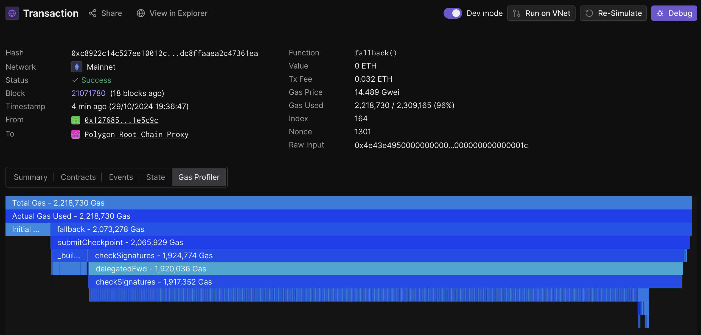
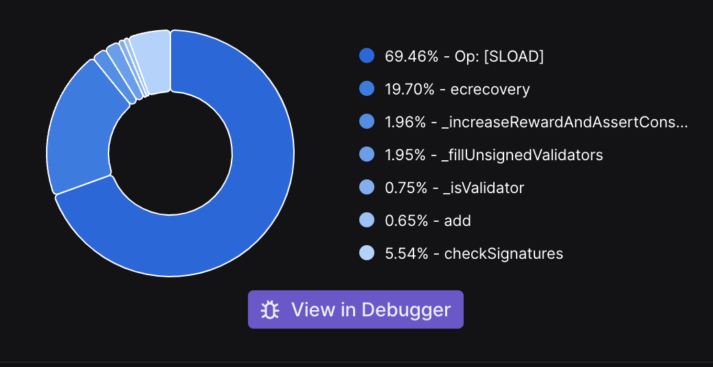

## Abstract

This proposal introduces a new mechanism to use zero-knowledge proofs to replace the existing checkpointing mechanism on Polygon PoS. The primary aim of this is to reduce gas costs for settlement on Ethereum, while still achieving the same behavior. The design moves the signature verification and validation of a checkpoint to an off-chain component reducing the on-chain costs associated with sending a simple proof.

## Background

Polygon PoS contains 2 layers — bor (execution layer based on geth/erigon) and heimdall (consensus layer based on tendermint). In order to facilitate bridging and settlement on Ethereum, Heimdall submits checkpoints at regular intervals containing a merkle root hash of a tree generated from a range of bor blocks and the message is signed by all validators and is later submitted to Ethereum. Checkpoints define an agreement of the supermajority (>⅔ weighted stake) of the validator set on a specific execution layer state.

## Motivation

Currently, every ~30 minutes, a new checkpoint with avg. length of 512 bor blocks is submitted on-chain to the root chain manager contract. A smart contract call is made, which validates the checkpoint and rewards the proposer and the validators who signed that checkpoint. 
The validation of checkpoints includes:
- Checking the sequence of the checkpoint
- Validating the signatures against the active validator set
- Checking if all of them together form a supermajority (>⅔) or not

While the logic seems trivial, the cost of verifying the signatures is very high.

### Status Quo

Below is the flame graph of a submit checkpoint call on Ethereum mainnet.



In summary:
- Total gas used: 2.2M
- Check Signatures function: 1.9M (~86%)
- Gas Price: 14.489 gwei
- Total cost: 0.032 ETH ~ 84$
- Check Signatures cost: 0.028 ETH ~ 73$

A decent amount of time goes into SLOAD (as we read data for all validators) and ecrecover (i.e. signature verification). This is because of the large validator set (~105) on PoS.



As checkpointing is a regular and frequent operation, validators spend significant gas submitting the checkpoint. Although there is scope for optimisations to save gas, it’s not significant.

## Specification

Using ZKPs for Checkpoint: With the construction of ZKPs (Zero Knowledge Proofs) becoming more efficient, it seems a viable option to leverage them to save on-chain gas costs. This proposal is to use a zero-knowledge proof that asserts that the majority of the validator set voted upon a checkpoint in Heimdall and offload the signature verification cost by replacing it with a simple proof verification. As of now, [SP1](https://github.com/succinctlabs/sp1) is intended to be used for generating ZK proofs.

***Prover / Circuit Design***

The goal is to design a circuit that reduces the possibility of generating false/fake proofs i.e. the proof should be generated for only the correct set of inputs and nothing else. Hence the inputs are chosen in a way that makes sure that they are validated against something and are provable. The circuit contains nothing but a series of assertions. Here are the inputs to the circuit:

| Input | Description | Source | Operations / Validation |
| --- | --- | --- | --- |
| tx_data (String) | Amino marshalled bytes of the checkpoint transaction in heimdall.  | Tendermint endpoint of a heimdall node. | The message is decoded to get the checkpoint message. The contents are hashed to get the transaction hash.  |
| tx_hash (B256 / 32 bytes) | Transaction hash of the checkpoint transaction | Tendermint endpoint of a heimdall node. | Verify if this hash matches with the one calculated above.  |
| sigs (Vec<String>) | Array of signatures from each validator for the checkpoint transaction | Tendermint endpoint of a heimdall node. | N/A |
| signers (Vec<Address>) | Array of validator address which were used to sign | Tendermint endpoint of a heimdall node. | Verify if the signer actually exists on the staking contracts on L1. Verify if the validator address derived from the checkpoint message and signature above is the same or not.  |
| state_sketch_bytes (Vec<u8>) | EVM State Sketch Bytes for calls to fetch staking data + last checkpoint. | RPC Endpoint of corresponding L1 (ethereum mainnet or sepolia) | Used to fetch the staking + validator info along with last checkpoint. |
| root_chain_info_address: Address | Address of the root chain info contract (which gives us staking info based on active validator set and last checkpoint info) | RPC Endpoint of corresponding L1 (ethereum mainnet or sepolia) | Use this to fetch data from L1. |
| l1_block_hash (B256 / 32 bytes) | L1 block hash to be used for fetching data | Chosen by prover (currently any valid block can be used, later restricted by timestamp) | Used to make the call to L1 based on this block. |
| bor_block_hash (B256 / 32 bytes) | Block hash (of the end block of checkpoint) | RPC Endpoint of corresponding bor node | N/A |

***Commits / Public Inputs***

Public inputs are nothing but the set of inputs that the verifier needs to provide. This is to ensure that the prover doesn’t generate fake proofs and that the proof has context. These are also called commits because the prover commits to these values. Hence, if the verifier provides the exact set of commit values, then and only then the proof verification passes (it fails in any other case). Here are the commits for checkpoint proof:

| Commit | Description |
| --- | --- |
| bor_block_number | New bor block number (which is being proved) (i.e. block number of the milestone end block) |
| bor_block_hash | New bor block hash (which is being proved) (i.e. block hash of the checkpoint end block) |
| l1_block_hash | The L1 block hash used to fetch the staking info.  |

***Pseudocode***

```python3
# Inputs
#  - tx_data
#  - tx_hash
#  - sigs
#  - signers
#  - state_sketch_bytes
#  - root_chain_info_address
#  - l1_block_hash
#  - bor_block_hash

# Construct checkpoint message
checkpoint = amino_unmarshal(tx_data)

# Verify the transaction hash
assert(hash(tx_data) == tx_hash)

# Fetch the last checkpoint info from l1
last_checkpoint_end_block = getLastCheckpointEndBlock(l1_block_hash, root_chain_info_address)

# Assert if we're generating proof for next checkpoint and nothing else
assert(checkpoint.start_block == last_checkpoint_end_block + 1)

# Assert if the number of signatures and signers are same (sanity check)
assert(sigs.len() == signers.len())

# Fetch the staking data from l1
(signers, powers, total_power) = getEncodedValidatorInfo(l1_block_hash, root_chain_info_address)

# Generate a map out of it for easy validation
validators_stakes = {signers[i]: powers[i] for i in range(len(signers)}

# Construct a message which was signed by validators
message = vec(1)
message.append(encode(checkpoint))

# Verify precommits
majority_power = 0
for i in range len(precommits):
		# Ensure that the signer is part of active validator set
		assert(signers[i] in validator_stakes.keys())

		# Verify if the signer address matches
		signer = extract_signer(keccak256(message, sigs[i]))
		assert(signer == signers[i])
		
		# Increment majority vote
		majority_power += power[i]
		
# Validate if we have reached 2/3+1 consensus
assert(majority_power > total_power / 3 * 2)

CheckpointProofCommit {
        bor_block_hash: input.bor_block_hash,
        l1_block_hash: input.l1_block_hash,
        bor_block_number: checkpoint.end_block,
    }

# Commit the values
return {
  bor_block_number, # bor block number
  bor_block_hash,   # bor block hash
  l1_block_hash,    # l1 block hash
}
```

***On-chain verification***

A PLONK proof is generated which can be verified on-chain using SP1’s verifier contract. If the proof was generated and verified correctly on-chain, it proves that the majority of validators voted on this checkpoint and signature verification on the contract can be removed. Because the 'check signatures' function also handles reward distribution for checkpoint, only the signature recovery can be replaced with a simple PLONK verify call. Hence, some of the SLOAD calls will remain and will account for the gas costs. While the PoC is still basic, it can be tweaked to commit values that the contract will be able to provide (e.g. the next checkpoint’s start number). This simplifies the design even more.

## Initial Results

We deployed this PoC on sepolia to capture some initial signature verification costs.

- PLONK Verify Call: 0.37M gas (this shouldn't be directly compared with the 1.9M signature verification cost as SLOAD is the primary gas consumer and not all of them can be removed).

Here’s a sepolia transaction verifying checkpoint for amoy testnet: [0x3fb1....5a17](https://sepolia.etherscan.io/tx/0x3fb166bc84e4c2861a781bfb928042a8bf56a3411157328dc3b2b2d960e75a17)

PLONK verification is mostly stateless and hence it is expected that a similar consumption on mainnet will happen as well.

While a good amount is being saved by reducing the on-chain costs, the proving costs cannot be ignored. These proofs were generated on Succinct’s Prover Network. One of the proof generation requests for amoy can be found [here](https://explorer.succinct.xyz/proof/01jangnysme6ebmqr961qmwsyb). As seen, it takes about ~4 mins to generate a PLONK proof.

It takes approximately 16 million cycles, which serves as a reliable metric for analyzing the cost and complexity of the circuit, to generate proofs on Amoy (which operates with 20 validators). While mainnet has 105 validators and the cost generally scales with the complexity of the computation, the relationship is not linear—meaning the increase in cost is less steep than the increase in complexity. Based on proving costs observed on the prover network, even with a significantly higher number of cycles, the cost remains manageable.

## Open Questions

The major open question is where to generate these proofs? Generating a PLONK proof requires a good amount of resources (e.g. >128 gb of ram). There are multiple approaches to this.
- Validators prove locally (no external dependency but not practical for every validator)
- Validators use SP1's prover network (seems reasonable, will have to onboard all of them to the prover network)
- Prover run by Polygon or any trusted 3rd party (easiest to achieve, ensure checkpoints can be submitted on someone else's behalf)

While these are not open questions, additional thought is needed on these aspects of the design.
1. Proving time. Currently, proof generation takes ~4 mins. Changes in heimdall will be required to accommodate this waiting time.
2. Backup options. While this approach is great, the old signature verification workflow cannot be completely removed as it will be required as a fail safe mechanism in the event of a prover liveness failure

## Backwards Compatibility

This approach/design will be implemented in parallel to the existing checkpoint flow and hence it won’t fully replace the existing one. To begin with, there will be two ways to submit checkpoints – one will be the traditional route where every validation will happen on-chain and another will be via submitting a proof, as discussed in this PIP. In case of issues in submitting a proof, one will still have the original method as backup.

## Test Cases

As it’s still in the design and ideation phase, only manual tests have been carried out. In the future, the testing process will be automated to test the approach on different cases. This section will be updated once the design is concrete.

## Reference Implementation

Here's the [link to the PoC](https://github.com/manav2401/zk-checkpoint) which was used to derive these results

## Security Considerations

There is a need to make sure that the circuit is sound i.e. the prover cannot generate proof with fake/false inputs. The circuit needs to be audited. Once the design is concrete, more details can be shared.

## Copyright

All copyrights and related rights in this work are waived under [CC0 1.0 Universal]([CCO 1.0 Universal](https://creativecommons.org/publicdomain/zero/1.0/legalcode)).