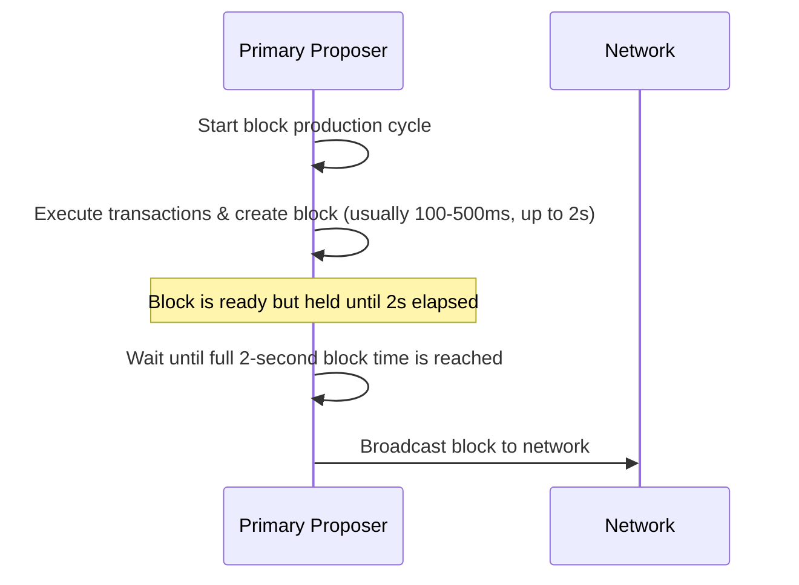
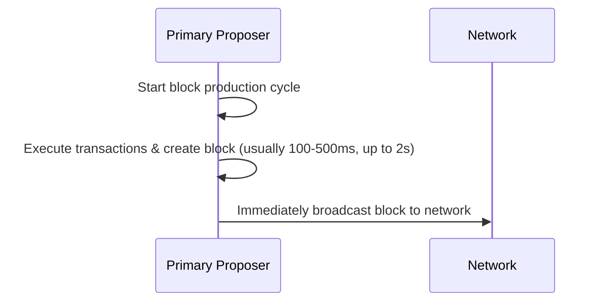

### Abstract
This proposal seeks to update the consensus rules to allow the primary block producers in the network to announce their block early (as soon as it's built) for better block propagation and reducing the chance of reorgs. As the change modifies consensus rules, it is proposed to be added with 
Bhilai Hardfork ([PIP-63](https://github.com/maticnetwork/Polygon-Improvement-Proposals/blob/main/PIPs/PIP-63.md)) scheduled next.

### Motivation
Currently, all the block producers follows a fixed block time through consensus (2s for primary block producers) during which it exeutes the transactions and assemble the next block. Metrics suggest that validators are able to create a full block in roughly 500ms (average case scenario) but have to wait for full 2s 
before announcing the block to rest of the network due to the way consensus works currently.

This introduces unnecessary idle time in the network. Moreover, it leads to delayed block propagation affecting critical applications and also increases the chance of reorgs as a backup block is announced by the secondary validator if the block from primary isn't seen on time. Allowing early announcement 
(if the block is ready) before it's expected time improves the propagation by a great factor.

### Specification
This proposal requires changes in the bor consensus mechanism to allow primary validators to announce blocks as soon as it's ready instead of waiting. This proposal also introduces changes in header verification logic in consensus allowing the rest of the network to import and process early blocks and reject maliciously sent headers.

The proposal won't change the announcement timings for non-primary validators as malicious actors could cause 1 block reorgs if allowed the same.

Workflows of current logic v/s proposed logic are shown below:

Current workflow:


Proposed workflow:


#### Consensus changes

1. In `Seal` function which is responsible for timing the release of a block
```diff
+delay = time.Until(time.Unix(int64(header.Time), 0)) // Wait until we reach header time for non-primary validators
+if successionNumber == 0 {
+  // For primary producers, set the delay to `header.Time - block time` instead of `header.Time`
+  // for early block announcement instead of waiting for full block time.
+  delay = time.Until(time.Unix(int64(header.Time-c.config.CalculatePeriod(number)), 0))
+}
-delay = time.Until(time.Unix(int64(header.Time), 0)) // Wait until we reach header time
```

2. In `verifyHeader` function which is responsible for block validation (including the header time and the time at which we received a block).
```diff
+if header.Time-c.config.CalculatePeriod(number) > uint64(time.Now().Unix()) {
+  return consensus.ErrFutureBlock
+}
-if header.Time > uint64(time.Now().Unix()) {
-  return consensus.ErrFutureBlock
-}
```

The above check leavs a slight window for non-primary validators to act maliciously so we also need to handle it later once we know the succession of the validator in `verifySeal`
```diff
+if succession != 0 {
+  if header.Time > uint64(time.Now().Unix()) {
+    return consensus.ErrFutureBlock
+  }
+}
```

### Backwards Compatibility
This change modifies the consensus rules and hence will require a hardfork. 

### Security Considerations
This change does not introduce new security risks. The adjustment while altering consensus rules stays fair for all validators and doesn't allow anyone to act maliciously affecting the network badly. 

### Copyright

All copyrights and related rights in this work are waived under [CCO 1.0 Universal](https://creativecommons.org/publicdomain/zero/1.0/legalcode).
